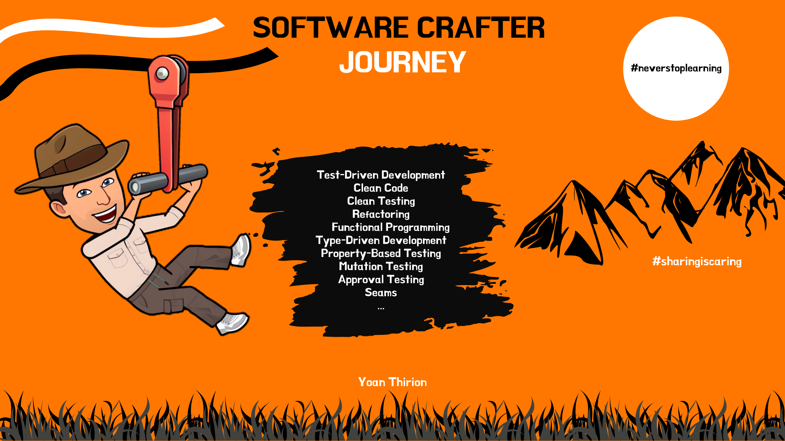

# Software Crafter Journey
This journey is an attempt to centralize useful resources (code katas, workshops, talks) that can help aspiring Software Craftsperson in their Journey.

## Fundamentals
- [What is software craftsmanship?](https://miro.com/app/board/uXjVPjg5-ks=/?share_link_id=130260708635)
  - [Egoless Crafting](https://egolesscrafting.org/)
- [Crappy-Driven Development - Clean Code](https://github.com/ythirion/crappy-driven-development/)
- [S.O.L.I.D principles](https://github.com/ythirion/solid-kata)
- [How to write Unit Tests](https://github.com/ythirion/unit-tests-intro)
- [Pair Programming](https://github.com/ythirion/pair-programming-kata)
- [Code Review Best Practices](https://github.com/ythirion/code-review)
- [Mob Programming](https://github.com/ythirion/mob-programming-kata)

## Test-Driven Development (aka T.D.D)
- [Generate Code From Usage](https://github.com/katalogs/learning-hours/blob/main/generate-code-from-usage/Facilitation.md)

### Basic
- [FizzBuzz](https://github.com/ythirion/fizzbuzz-kata)
- [Stack](https://github.com/ythirion/stack-kata)
- [Bowling](https://github.com/ythirion/scala-kata-logs/blob/main/BowlingKata/README.md)
- [Roman Numerals](https://github.com/ythirion/clean-crafter/blob/main/tdd-kata/README.md)

### Designing with TDD
- [Money Problem](https://github.com/ythirion/TDD-money-problem)
- [Yatzee](https://github.com/ythirion/scala-kata-logs/tree/main/YahtzeeKata)
- [Mars Rover](https://github.com/ythirion/scala-kata-logs/blob/main/MarsRoverKata/README.md)

### TDD on algorithms
- [Diamond](https://github.com/ythirion/scala-kata-logs/blob/main/DiamondKata/README.md)
- [Lags](https://github.com/ythirion/scala-kata-logs/blob/main/LagsKata/README.md)

### Outside-In TDD
- [Bank Kata](https://github.com/ythirion/bank-kata)

### Test && Commit || Revert (aka TCR)
- [Submarine kata](https://github.com/les-tontons-crafters/submarine-tcr)

## Legacy code refactoring
- [Refactoring journey](https://github.com/ythirion/refactoring-journey)
- [Gilded Rose](https://github.com/ythirion/scala-kata-logs/blob/main/GildedRoseKata/README.md)
- [Yatzy](https://github.com/ythirion/scala-kata-logs/tree/main/YatzyRefactoringKata)
- [Untangled Conditionals Kata](https://github.com/ythirion/untangled-conditionals-kata)
- [Elections](https://github.com/ythirion/scala-kata-logs/blob/main/ElectionsKata/README.md)
- [Ugly trivia game](https://github.com/ythirion/pair-programming-kata)
- [Trip service - refactoring with Seams](https://github.com/ythirion/clean-crafter/blob/main/tripservice-kata/README.md)
- [Theatrical Players Kata](https://yoan-thirion.gitbook.io/knowledge-base/software-craftsmanship/code-katas/theatrical-players-refactoring-kata)

### Mikado
- [Mikado kata](https://yoan-thirion.gitbook.io/knowledge-base/software-craftsmanship/code-katas/mikado-method)
- [Mikado Method and Test Data Builders](https://github.com/ythirion/mikado-testbuilders-kata)

## Clean Testing
- [Anatomy of Unit Tests](https://github.com/katalogs/learning-hours/blob/main/clean-testing/1-test-anatomy/Facilitation.md)
- [Test Doubles](https://github.com/katalogs/learning-hours/blob/main/clean-testing/4-test-doubles/Facilitation.md)
- [Parameterized Tests](https://github.com/katalogs/learning-hours/blob/main/clean-testing/5-parameterized-tests/Facilitation.md)
- [Styles of Unit Tests](https://github.com/katalogs/learning-hours/blob/main/clean-testing/6-styles-of-unit-tests/Facilitation.md)
- [The hunt for anti-patterns](https://github.com/katalogs/learning-hours/blob/main/clean-testing/7-anti-patterns/Facilitation.md)
- [The hunt for 100% code coverage](https://github.com/katalogs/learning-hours/blob/main/clean-testing/8-hunt-to-100percent-coverage/Facilitation.md)

### Fluent Assertions
- [AssertJ in practice](https://github.com/ythirion/assertj-kata)

### Approval Testing
- [Approval Testing in C#](https://github.com/ythirion/approval-csharp-kata)

### Test Data Builders
- [Refactoring test inputs with Test Data Builders](https://github.com/katalogs/learning-hours/blob/main/test-data-builders/refactoring-test-inputs-with-test-data-builders/Facilitation.md)
- [Business oriented Test Data Builders](https://github.com/katalogs/learning-hours/blob/main/test-data-builders/business-oriented-test-data-builders/Facilitation.md)

## Functional Programming (FP)
- [Design Patterns in FP](https://github.com/ythirion/scala-fp-guidelines)
- [Functional Programming made easy in Java & C#](https://speakerdeck.com/thirion/functional-programming-made-easy-in-java-and-c-number)
	- [java with vavr](https://github.com/ythirion/vavr-kata)
	- [C# with Language-Ext](https://github.com/ythirion/language-ext-kata)
- [FP 101 on the JVM](https://github.com/ythirion/fp101)
- [Kotlin for java refugees](https://ythirion.github.io/kotlin-for-java-refugees/)

### Baby steps to FP
- [Pure Functions](https://github.com/katalogs/learning-hours/blob/main/functional-programming/1-pure-functions/Facilitation.md)
- [Functors](https://github.com/katalogs/learning-hours/blob/main/functional-programming/2-functors/Facilitation.md)
- [Monads (Option)](https://github.com/katalogs/learning-hours/blob/main/functional-programming/3-monads-part1/Facilitation.md)
- [Monads (Try, Either)](https://github.com/katalogs/learning-hours/blob/main/functional-programming/4-monads-part2/Facilitation.md)
- [FP in Real Life](https://github.com/katalogs/learning-hours/blob/main/functional-programming/5-real-life-example/Facilitation.md)

#### Bonus
- [Discriminated Unions](https://github.com/katalogs/learning-hours/blob/main/functional-programming/6-discriminated-unions/Facilitation.md)	

### Property-Based Testing (PBT)
- [A Journey to Property-Based Testing](https://github.com/ythirion/journey-to-property-based-testing)
- [Bulletproof your code with "Mutation-Based Property-Driven Development"](https://github.com/ythirion/nir-kata)
- [Type-Driven Development with PBT](https://github.com/ythirion/snafu-kata)

## Design
- [DDD / Clean Architecture / Tell don't ask Kata](https://github.com/les-tontons-crafters/tell-dont-ask-kata)
- [Test your Architecture with ArchUnit](https://github.com/ythirion/archunit-examples)
- [Improve the design and testing of your micro-services through Consumer-Driven Contract Testing](https://github.com/ythirion/pact-jvm-demo)

### Specification Pattern
- [Discover the Specification Pattern](https://github.com/katalogs/learning-hours/blob/main/specification-pattern/discover-specification-pattern/Facilitation.md)
- [Specification Pattern 2.0](https://github.com/katalogs/learning-hours/blob/main/specification-pattern/specification-2.0/Facilitation.md)

## All in one - Xtrem T.D.D
[Xtrem T.D.D](https://github.com/les-tontons-crafters/submarine-tcr) is a kata that demonstrates a lot of craft practices:
- [Mutation Testing](https://github.com/les-tontons-crafters/xtrem-tdd-money-kata/blob/main/docs/facilitation/01.mutation-testing.md)
- [T.D.D from scratch](https://github.com/les-tontons-crafters/xtrem-tdd-money-kata/blob/main/docs/facilitation/02.portfolio.md)
- [Fight Primitive Obsession / T.D.D on existing code](https://github.com/les-tontons-crafters/xtrem-tdd-money-kata/blob/main/docs/facilitation/03.no-primitive-types.md)
- [Avoid for Loops](https://github.com/les-tontons-crafters/xtrem-tdd-money-kata/blob/main/docs/facilitation/04.no-for-loops.md)
- [Immutability](https://github.com/les-tontons-crafters/xtrem-tdd-money-kata/blob/main/docs/facilitation/05.only-immutable-types.md)
- [Avoid Exceptions](https://github.com/les-tontons-crafters/xtrem-tdd-money-kata/blob/main/docs/facilitation/06.no-exception-authorized.md)
- [Use existing monads](https://github.com/les-tontons-crafters/xtrem-tdd-money-kata/blob/main/docs/facilitation/07.use-existing-monad.md)
- [Property-Based Testing to challenge a Domain Model](https://github.com/les-tontons-crafters/xtrem-tdd-money-kata/blob/main/docs/facilitation/08.bank-properties.md)
- [Example Mapping](https://github.com/les-tontons-crafters/xtrem-tdd-money-kata/blob/main/docs/facilitation/09.bank-example-mapping.md)
- [Redesign the Bank](https://github.com/les-tontons-crafters/xtrem-tdd-money-kata/blob/main/docs/facilitation/10.redesign-bank.md)
- [Acceptance Testing](https://github.com/les-tontons-crafters/xtrem-tdd-money-kata/blob/main/docs/facilitation/11.acceptance-tests.md)
- [Functional Core, Imperative Shell](https://github.com/les-tontons-crafters/xtrem-tdd-money-kata/blob/main/docs/facilitation/12.functional-core-imperative-shell.md)

## Other Resources
- [Technical Debt Workshop](https://yoan-thirion.gitbook.io/knowledge-base/software-craftsmanship/technical-debt-workshop)
- [F# for OO Programmers](https://yoan-thirion.gitbook.io/knowledge-base/software-craftsmanship/f-for-oo-programmers)
- [Improve your test quality with Mutation testing](https://yoan-thirion.gitbook.io/knowledge-base/software-craftsmanship/testing/mutation-testing)
- [Software Design X-Rays](https://yoan-thirion.gitbook.io/knowledge-base/software-craftsmanship/software-design-x-rays/workshop)
- [50 shades of Dev Practices](https://speakerdeck.com/thirion/50-shades-of-dev-practices)
- [Programmer's Brain](https://miro.com/app/board/o9J_l0DSaRQ=/?share_link_id=531195470496)
- [Cultivate Team Learning with Xtrem Reading](https://yoan-thirion.gitbook.io/knowledge-base/xtrem-reading/cultivate-team-learning-with-xtrem-reading)
- [Libérez vos entretiens d’embauche avec la gamification](https://yoan-thirion.gitbook.io/knowledge-base/serious-games/craftsminator)
- [Programmer's Brain - What every programmer needs to know about cognition](https://miro.com/app/board/o9J_l0DSaRQ=/?share_link_id=531195470496)
- [Developer Ethics](https://yoan-thirion.gitbook.io/knowledge-base/software-craftsmanship/practices/dev-ethics)
- [Co-designs - From high level Architecture to Solution Design by working collaboratively](https://yoan-thirion.gitbook.io/knowledge-base/software-craftsmanship/practices/co-designs)
- [Design sessions - Collaborative Design](https://yoan-thirion.gitbook.io/knowledge-base/software-craftsmanship/practices/design-sessions)
- [How to Interview Domain Experts](https://yoan-thirion.gitbook.io/knowledge-base/software-craftsmanship/practices/interview-domain-experts)
- [Fundamentals of Software Architecture](https://yoan-thirion.gitbook.io/knowledge-base/software-architecture/fundamentals-of-software-architecture)
- [Aligning Product & Software Design](https://yoan-thirion.gitbook.io/knowledge-base/software-architecture/aligning-product-and-software-design)
- [Domain Driven Design re-Distilled](https://yoan-thirion.gitbook.io/knowledge-base/software-architecture/ddd-re-distilled)
- [Xanpan - a team centric agile method story](https://yoan-thirion.gitbook.io/knowledge-base/agile-coaching/xanpan-a-team-centric-agile-method-story)
- [How to start a Community Of Practices](https://yoan-thirion.gitbook.io/knowledge-base/agile-coaching/how-to-run-a-community-of-practices-cop)
- [Drive and Intrinsic motivation](https://speakerdeck.com/thirion/drive-and-intrinsic-motivation-a-toolkit-for-todays-managers)

## My Book Infographics
All my book infographics are available from [here](https://yoan-thirion.gitbook.io/knowledge-base/xtrem-reading/my-book-infographics)
- `The Software Craftsman` by Sandro Mancuso
- `Leadership is language` by David Marquet
- `Culture is Everything` by Tristan White
- `Samman Technical Coaching` by Emily Bache
- `Leadership Strategy and Tactics: Field Manual` by Jocko Willink
- `Software-Design X-Rays` by Adam Tornhill
- `Succeeding with OKRs in Agile` by Allan Kelly
- `Team Topologies` by Matthew Skelton, Manuel Pais
- `Refactoring at Scale: Regaining Control of Your Codebase` by Maude Lemaire
- `La Liberté du Commandement` par Loïc Finaz
- `The programmer's brain` by Felienne Hermans
- `Unit Testing Principles, Practices, and Patterns` by Vladimir Khorikov
- `How to avoid a climate disaster` by Bill Gates
- `Tu fais quoi dans la vie` by Joséphine Bouchez et Mathieu Dardaillon
- `Une vie sur notre planète` by David Attenborough
- `Code that Fits in Your Head` by Mark Seemann
- `Software craft, TDD, Clean Code et autres pratiques essentielles` par Cyrille Martraire, Arnaud Thiéfaine, Dorra Bartaguiz, Fabien Hiegel, Houssam Fakih
- `The Good Life - Ce que nous apprend la plus longue étude scientifique sur le bonheur et la santé` par Robert Waldinger, Marc M.D. Schulz
